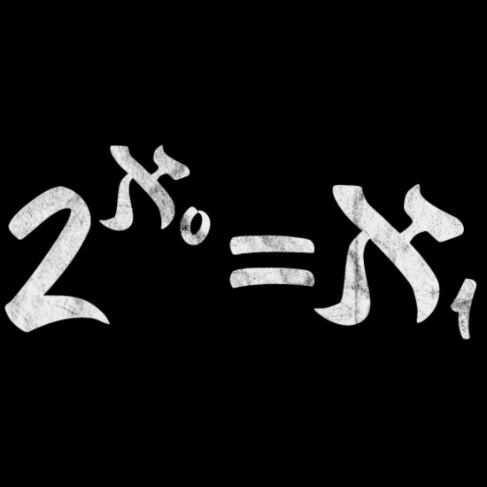

# Set Theory

Image taken from [this website.](https://www.spreadshirt.com.au/shop/design/continuum+hypothesis+math+mathematics+axiomatics+mens+t-shirt-D59a7b5bdf6c60d221da09534?sellable=XyJEorArkOHLeR3y8dRR-210-7&view=D1)

Course in Set Theory, Master EPFL (2012)

The course materials and exercises are located in the `/course` and `/exercises` folders, respectively.
