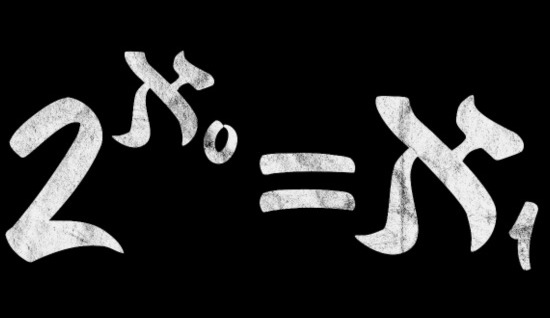

# Set Theory

Image taken from [this website](https://www.google.com/imgres?q=continuum%20hypothesis&imgurl=https%3A%2F%2Fimage.spreadshirtmedia.com%2Fimage-server%2Fv1%2Fcompositions%2FT210A2PA4301PT17X53Y58D1012379226W22519H9448%2Fviews%2F1%2Cwidth%3D550%2Cheight%3D550%2CappearanceId%3D2%2CbackgroundColor%3D000000%2CnoPt%3Dtrue%2Fcontinuum-hypothesis-math-mathematics-axiomatics-mens-t-shirt.jpg&imgrefurl=https%3A%2F%2Fwww.spreadshirt.com.au%2Fshop%2Fdesign%2Fcontinuum%2Bhypothesis%2Bmath%2Bmathematics%2Baxiomatics%2Bmens%2Bt-shirt-D59a7b5bdf6c60d221da09534%3Fsellable%3DXyJEorArkOHLeR3y8dRR-210-7&docid=y1odVObR2WrotM&tbnid=8Jm_GAMUVxMahM&vet=12ahUKEwiup8XNmuSIAxVX4AIHHbEUAUkQM3oECDsQAA..i&w=550&h=550&hcb=2&itg=1&ved=2ahUKEwiup8XNmuSIAxVX4AIHHbEUAUkQM3oECDsQAA)

Course in Set Theory, Master EPFL (2012)

The course materials and exercises are located in the `/course` and `/exercises` folders, respectively.
